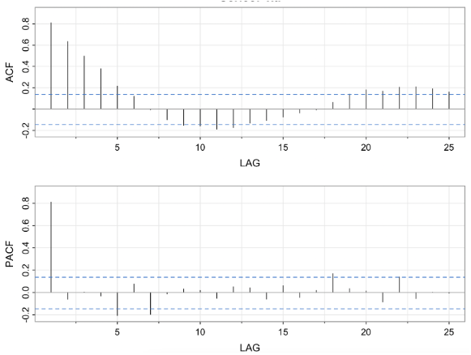

```{r setup, include=FALSE}
knitr::opts_chunk$set(echo = TRUE)
```

## Front Matter

```{r}
library(astsa)
library(ggplot2)
library(reactable) 
```

## Question 1

> Consider the folowing short time series data set
>
> | $t$ | 1 | 2 | 3 | 4 | 5 | 6 | 7 | 8 | 9 | 10 |
> | :--- | :---: | :---: | :---: | :---: | :---: | :---: | :---: | :---: | :---: | :---: |
> | $x_t$ | 58 | 29 | 46 | 56 | 53 | 61 | 52 | 67 | 76 | 56 |
>
><br>
>
> | $t$ | 11 | 12 | 13 | 14 | 15 | 16 | 17 | 18 | 19 | 20 |
> | :--- | :---: | :---: | :---: | :---: | :---: | :---: | :---: | :---: | :---: | :---: |
> | $x_t$ | 48 | 48 | 57 | 65 | 57 | 49 | 60 | 59 | 52 | 54 |
>
>Evaluate each of the following expressions:
>
> 1. $B^{16}x_{17}$
> 2. $(1 - B^{12})x_{20}$
> 3. $\nabla x_{11}$
> 4. $\nabla^2x_{10}$
> 5. $\nabla_3x_{10}$
> 6. $(1-B)(1-0.4B - 0.6B^2)x_9$

The evaluations are:

1. $B^{16}x_17 = x_{17 - 16} = x_{1} = 58$
2. $(1 - B^{12})x_{20} = x_{20} - B^{12}x_{20} = x_{20} - x_{8} = 54 - 67 = -13$
3. $\nabla x_{11} = x_{11} - x_{11 - 1} = x_{11} - x_{10} = 48-56 = -8$
4. $\nabla^2x_{10} = (1 - B)^2 \cdot x_{10} = (1 - 2B + B^2)\cdot x_{10} = x_{10} - 2\cdot Bx_{10} + B^2x_{10}=\\ \quad x_{10} - 2x_{9} + x_{8} = 56 - (2)(76) + 67 = -29$
5. $\nabla_3x_{10} = x_{10 - 3} = x_{10} - x_{7} = 56 - 52 = 4$
6. $(1-B)(1-0.4B - 0.6B^2)x_9 = (1 - 0.4B - 0.6B^2 -B + 0.4B^2 + 0.6B^3)x_9 = \\ \quad (1 - 1.4B - 0.2B^2 + 0.6B^3)x_9 =  x_9 - 1.4Bx_9 - 0.2B^2x_9 + 0.6B^3x_9 = \\ \quad  x_9 - 1.4x_8 - 0.2x_7 + 0.6x_6 = 76 - (1.4)(67) - (0.2)(52) + (0.6)(61) = 8.4$

## Question 2

> Write out the autoregressive and moving average polynomials for the following model:
>
> $x_t = 0.35x_{t - 1} - 0.5x_{t - 2} + w_t + 0.7w_{t - 1} + 0.46w_{t - 2}$
>
> Hint The key structure for this sanswer is (AR Polynomial)$x_t$ = (MA polynomial)$w_t$.

Solution for polynomials in terms of $x_{t}$ and $w_{t}$:

$$
\begin{aligned}
&x_t = 0.35x_{t - 1} - 0.5x_{t - 2} + w_t + 0.7w_{t - 1} + 0.46w_{t - 2} \\ \\
&x_t - 0.35x_{t - 1} + 0.5x_{t - 2} = w_t + 0.7w_{t - 1} + 0.46w_{t - 2} \\ \\
&(1 - 0.35B + 0.5B^2)x_t = (1 + 0.7B + 0.46B^2)w_{t}
\end{aligned}
$$

## Question 3

> Consider the MA(1) model $x_t = 5 + w_t + 0.6w_{t-1}$ where $w_t \overset{iid}{\sim} N(0, \sigma^2_w)$
> 
> A. Give the numerical value for the first lag autocorrelation.
>
> B. Give the numerical value for the second lag autocorrelation.
>
> C. Describe the appearnece of the ACF for the model.
>
> D. Use R to sketch the ACF for this model using the following commands
> ```r
> acfprob3=ARMAacf(ma=c(.6), lag.max=10)
> plot(seq(0,10), acfprob3, xlim=c(1,10), xlab="lags", type="h") 
> ```
> 
> E. Use R to obtain the PACF of this model using the following commands:
> ```r
> pacfprob3 = ARMAacf(ma=c(.6), lag.max=10, pacf=TRUE)
> plot(pacfprob3, type="h")
> ```

A. The first lag autocorrelation is:

$$
\rho_1 = \frac{\theta_1}{1 + \theta^2_1} = \frac{0.6}{1 + 0.6^2} \approx 0.4412
$$

B. The second lag autocorrelation is 0 for MA(1) models.


C. The plot would theoretically be a single bar that rises to approximately 0.4412 on the vertical axis and all subsequent lags would be 0


D. The following is a sketch of the ACF for this model using R:

```{r}
acfprob3=ARMAacf(ma=c(.6), lag.max=10)
plot(seq(0,10), acfprob3, xlim=c(1,10), xlab="lags", type="h") 
```

E. The following is a the PACF for the model using R:

```{r}
pacfprob3 = ARMAacf(ma=c(.6), lag.max=10, pacf=TRUE)
plot(pacfprob3, type="h")
```

## Question 4

> Consider the AR(1)  model $x_t = 4 - 0.6x_{t - 1 + w_{t}$
> A. Give the numerical value for the first lag autocorrelation
>
> B. Give the numerical value for the second lag autocorrelation
> 
> C. Give the numerical value for the third lag autocorrelation
>
> D. Describe the appearance of the PACF for this model
> 
> E. Use R to skethc the ACF for this model:
>```r
> acfprob4=ARMAacf(ar=c(-.6), lag.max=10)
> lags=0:10
> plot(lags, acfprob4, xlim=c(1,10), type="h") 
>```
>
> F. Use R to get the PACF of this model.
>```r
> pacfprob4 = ARMAacf(ar=c(-.6), lag.max=10, pacf=TRUE) 
> plot(pacfprob4, type="h") 
>```

A. The lag autocorrelation can be found using the equation $\rho_p = \phi^h_1$, so it follows then that the first lag autocorrelation is $-0.6^1 = 0.6$

B. Similar to part A, the second lag autocorrelation is $-0.6^2 = 0.36$

C. Following the trend from part B, the third lag autocorrelation is $-0.6^3 = -0.216$

D. Would be There should be a singular bar at the first lag. The other partial autocorrelations should be 0 or insignificant.

E. The following is the R code to sketch the ACF for this model:

```{r}
acfprob4=ARMAacf(ar=c(-.6), lag.max=10)
lags=0:10
plot(lags, acfprob4, xlim=c(1,10), type="h") 
```

F. The following is  the R code to render the PACF of this model.
```{r}
pacfprob4 = ARMAacf(ar=c(-.6), lag.max=10, pacf=TRUE) 
plot(pacfprob4, type="h")
```

## Question 5

> The time series for this problem is stride length measured every 30 seconds for a runner on a treadmill moving at pace of 7 minutes per mile.  
>
> Following are the ACF and PACF for the series. Briefly describe what model(s) may be suggested by these plots (and explain why). 
> 
> 

Given the singular large bar in the PACF plot, it seems that an AR(1) model is the most appropriate.  
